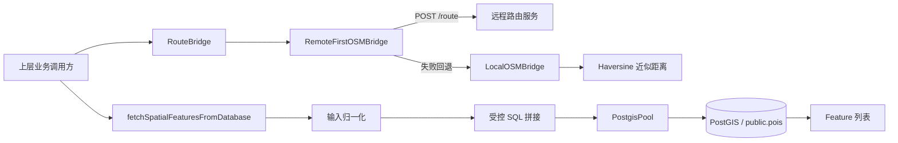
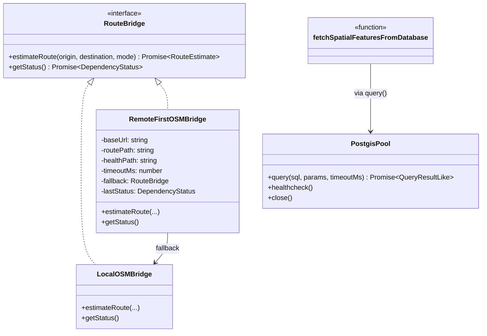

本页聚焦 GeoLoom Agent 中**空间数据服务层**的两个核心职责：其一是以 OSM 桥接形式提供路径距离估算能力，其二是以 PostGIS 为底座提供只读空间要素检索能力。就代码证据而言，这一层并不承担前端地图渲染、AI 编排或 SSE 传输，而是作为后端中的**外部空间能力适配层与空间事实查询层**，向上输出统一的距离估算结果与 GeoJSON Feature 集合。Sources: [osmBridge.ts](backend/src/integration/osmBridge.ts#L1-L192), [postgisPool.ts](backend/src/integration/postgisPool.ts#L1-L73), [fetchSpatialFeatures.ts](backend/src/spatial/fetchSpatialFeatures.ts#L1-L209)

从第一性原理看，该层解决的是两个不同但互补的问题：**“怎么得到空间事实”**与**“怎么在依赖不稳定时保持服务可用”**。PostGIS 部分围绕 `public.pois` 表执行受限查询；OSM 桥接部分围绕 `RouteBridge` 抽象，在远程路由服务可用时优先调用远端，不可用时退化为本地直线距离近似。这个组合说明系统更关注“可持续提供空间证据”，而不是追求单一路径上的最高精度。Sources: [osmBridge.ts](backend/src/integration/osmBridge.ts#L11-L15), [osmBridge.ts](backend/src/integration/osmBridge.ts#L67-L191), [fetchSpatialFeatures.ts](backend/src/spatial/fetchSpatialFeatures.ts#L172-L209)

## 你当前所在位置与阅读边界

你当前位于 [空间数据服务：OSM 桥接与 PostGIS 存储](6-kong-jian-shu-ju-fu-wu-osm-qiao-jie-yu-postgis-cun-chu)。本页只讨论空间服务适配、连接配置、查询约束、退化策略与返回结构，不展开智能体调度、请求生命周期、前端地图渲染和向量检索等主题。若你希望继续理解这些空间结果如何进入请求处理链路，下一步最自然的是阅读 [请求生命周期管理：从用户输入到流式响应](7-qing-qiu-sheng-ming-zhou-qi-guan-li-cong-v2-dao-v4-de-jia-gou-die-dai) 与 [核心技能模块：PostGIS、空间编码与语义选择](4-he-xin-ji-neng-mo-kuai-postgis-kong-jian-bian-ma-yu-yu-yi-xuan-ze)。Sources: [osmBridge.ts](backend/src/integration/osmBridge.ts#L11-L15), [postgisPool.ts](backend/src/integration/postgisPool.ts#L27-L72), [fetchSpatialFeatures.ts](backend/src/spatial/fetchSpatialFeatures.ts#L172-L209)

## 架构总览：空间服务层如何组织

在代码层面，空间服务由三个紧密耦合但职责清晰的模块组成：`osmBridge.ts` 负责路径距离桥接，`postgisPool.ts` 负责数据库连接池与查询超时控制，`fetchSpatialFeatures.ts` 负责把外部输入归一化为受控 SQL，并将结果映射为 GeoJSON 风格的 Feature。它们共同形成一个“**输入归一化 → 能力调用 → 结构化输出**”的空间服务面。Sources: [osmBridge.ts](backend/src/integration/osmBridge.ts#L33-L191), [postgisPool.ts](backend/src/integration/postgisPool.ts#L41-L72), [fetchSpatialFeatures.ts](backend/src/spatial/fetchSpatialFeatures.ts#L25-L209)

下面这张 Mermaid 图用于帮助理解模块边界：图中并不是运行时部署图，而是代码职责图。左侧是调用方，中间是空间服务适配层，右侧分别是远程路由服务与 PostGIS 数据库；其中 OSM 桥接具备显式退化路径，而 PostGIS 查询以只读 SQL 为主。Sources: [osmBridge.ts](backend/src/integration/osmBridge.ts#L67-L191), [postgisPool.ts](backend/src/integration/postgisPool.ts#L41-L72), [fetchSpatialFeatures.ts](backend/src/spatial/fetchSpatialFeatures.ts#L172-L209)



## 目录与模块分布

从仓库结构看，空间数据服务并没有散落在多个业务子域，而是集中在两个目录：`backend/src/integration` 放置外部能力桥接与连接池，`backend/src/spatial` 放置具体空间查询实现；此外 `backend/SKILLS/PostGIS/SKILL.md` 说明了 PostGIS 在系统中的定位是“只读空间事实技能”。这种布局表明作者把“连接外部能力”和“执行空间事实查询”区分为两个层次。Sources: [SKILL.md](backend/SKILLS/PostGIS/SKILL.md#L1-L17), [osmBridge.ts](backend/src/integration/osmBridge.ts#L1-L192), [postgisPool.ts](backend/src/integration/postgisPool.ts#L1-L73), [fetchSpatialFeatures.ts](backend/src/spatial/fetchSpatialFeatures.ts#L1-L209)

```text
backend/
├── src/
│   ├── integration/
│   │   ├── osmBridge.ts
│   │   ├── postgisPool.ts
│   │   ├── httpClient.ts
│   │   └── dependencyStatus.ts
│   └── spatial/
│       └── fetchSpatialFeatures.ts
└── SKILLS/
    └── PostGIS/
        └── SKILL.md
```
Sources: [osmBridge.ts](backend/src/integration/osmBridge.ts#L1-L192), [postgisPool.ts](backend/src/integration/postgisPool.ts#L1-L73), [httpClient.ts](backend/src/integration/httpClient.ts#L1-L44), [dependencyStatus.ts](backend/src/integration/dependencyStatus.ts#L1-L93), [fetchSpatialFeatures.ts](backend/src/spatial/fetchSpatialFeatures.ts#L1-L209), [SKILL.md](backend/SKILLS/PostGIS/SKILL.md#L1-L17)

## OSM 桥接：统一路径距离接口

`osmBridge.ts` 首先定义了 `RouteEstimate` 和 `RouteBridge` 两个核心契约。前者约束输出必须包含 `distance_m`、`duration_min`、`degraded` 与 `degraded_reason`；后者约束实现类必须提供 `estimateRoute()` 与 `getStatus()`。这意味着无论底层是远程路由服务还是本地近似计算，上层都面对一致的数据面和状态面。Sources: [osmBridge.ts](backend/src/integration/osmBridge.ts#L4-L14)

### 本地退化实现：LocalOSMBridge

`LocalOSMBridge` 是明确的降级实现，不是主路由引擎。它先通过 `haversineDistanceMeters()` 计算球面直线距离，再乘以 `1.25` 作为路径长度近似；随后根据模式选择速度：`driving` 使用 `600`，其他模式使用 `75`，最后推导分钟级时长。返回结果中 `degraded` 被硬编码为 `true`，原因固定为 `routing_service_unavailable`。因此，这个实现的核心价值不是精确导航，而是在远程服务缺席时仍然返回**结构完整、可消费的距离估算**。Sources: [osmBridge.ts](backend/src/integration/osmBridge.ts#L16-L56)

`LocalOSMBridge.getStatus()` 也清楚体现了这一点：它把依赖名标记为 `route_distance`，`ready: true`，`mode: 'local'`，`degraded: true`，`reason: 'remote_unconfigured'`。也就是说，在作者定义里，“本地退化可用”仍算服务就绪，但属于降级状态，而不是完全不可用状态。Sources: [osmBridge.ts](backend/src/integration/osmBridge.ts#L47-L55), [dependencyStatus.ts](backend/src/integration/dependencyStatus.ts#L4-L30)

### 远程优先实现：RemoteFirstOSMBridge

`RemoteFirstOSMBridge` 是真实的桥接主实现。它从构造参数或环境变量读取 `baseUrl`、`routePath`、`healthPath`、`timeoutMs`，并允许注入 `fetchImpl` 与 `fallback`。默认回退实现就是 `new LocalOSMBridge()`。这意味着其设计目标不是“远程必须存在”，而是“远程优先、回退内建”。Sources: [osmBridge.ts](backend/src/integration/osmBridge.ts#L58-L110)

在 `estimateRoute()` 中，逻辑路径非常直接：如果 `baseUrl` 为空，则立即调用 fallback；如果 `baseUrl` 存在，则通过 `requestJson()` 以 `POST` 请求调用远程 `/route` 接口，body 为 `{ origin, destination, mode }`。只要远端成功，状态就会被更新为 `mode: 'remote'` 且 `degraded: false`；一旦抛错，则状态切换为 `mode: 'fallback'`、`reason: 'remote_request_failed'`，然后再执行本地退化估算。这个流程说明系统对远程服务失败的处理不是报错中止，而是**保留可用性并显式记录证据弱化**。Sources: [osmBridge.ts](backend/src/integration/osmBridge.ts#L112-L154), [httpClient.ts](backend/src/integration/httpClient.ts#L18-L43)

`getStatus()` 使用相同理念：若未配置 `baseUrl`，直接返回当前状态；若已配置，则调用健康检查路径，成功时标记远程健康，失败时标记为 fallback degraded。它不会因为健康检查失败把 `ready` 设为 `false`，而是仍维持 `ready: true`，只是说明当前只能退化运行。对于一个需要连续回答空间问题的系统来说，这是一种典型的“**可答优先**”状态语义。Sources: [osmBridge.ts](backend/src/integration/osmBridge.ts#L156-L190), [dependencyStatus.ts](backend/src/integration/dependencyStatus.ts#L32-L67)

### OSM 桥接配置项

下表汇总了 OSM 桥接的可验证配置来源与语义。所有条目都直接来自 `RemoteFirstOSMBridge` 构造逻辑。Sources: [osmBridge.ts](backend/src/integration/osmBridge.ts#L58-L110)

| 配置项 | 来源 | 默认值 | 作用 |
|---|---|---:|---|
| `baseUrl` | `options.baseUrl` / `ROUTING_BASE_URL` | `''` | 远程路由服务基础地址 |
| `routePath` | `options.routePath` / `ROUTING_ROUTE_PATH` | `/route` | 路径估算接口 |
| `healthPath` | `options.healthPath` / `ROUTING_HEALTH_PATH` | `/health` | 健康检查接口 |
| `timeoutMs` | `options.timeoutMs` / `ROUTING_TIMEOUT_MS` | `3000` | 远程请求超时 |
| `fallback` | `options.fallback` | `LocalOSMBridge` | 远程失败后的回退实现 |

## PostGIS 存储接入：连接池与执行边界

`postgisPool.ts` 展示了 PostGIS 的接入方式并不复杂，但边界定义非常明确。`buildPostgisPoolConfig()` 从环境变量或显式 options 中组装连接参数，默认主机为 `127.0.0.1`、端口为 `15432`、用户名 `postgres`、密码 `123456`、数据库 `geoloom`、连接池上限 `10`。这说明代码预设了一个本地开发导向的 PostGIS 环境，同时允许通过环境变量覆盖。Sources: [postgisPool.ts](backend/src/integration/postgisPool.ts#L18-L39)

`PostgisPool` 类只公开三个主要能力：`query()`、`healthcheck()` 与 `close()`。其中 `query()` 每次从池中借出 client，先执行 `SET LOCAL statement_timeout = ...`，再执行业务 SQL，最后无条件释放连接；这使查询超时被控制在连接级别的局部事务上下文中，而不是全局数据库参数中。`healthcheck()` 只执行 `SELECT 1`，证明该模块定位在**轻量连接管理器**，而不是 ORM 或 Repository。Sources: [postgisPool.ts](backend/src/integration/postgisPool.ts#L41-L72)

### PostGIS 连接配置表

下表总结了可验证的 PostGIS 环境变量与默认值。Sources: [postgisPool.ts](backend/src/integration/postgisPool.ts#L18-L39)

| 环境变量 | 默认值 | 含义 |
|---|---:|---|
| `POSTGRES_HOST` | `127.0.0.1` | 数据库主机 |
| `POSTGRES_PORT` | `15432` | 数据库端口 |
| `POSTGRES_USER` | `postgres` | 数据库用户名 |
| `POSTGRES_PASSWORD` | `123456` | 数据库密码 |
| `POSTGRES_DATABASE` | `geoloom` | 数据库名 |
| `POSTGRES_POOL_MAX` | `10` | 连接池最大连接数 |

## 空间查询实现：从输入归一化到 Feature 输出

真正面向空间事实读取的实现位于 `fetchSpatialFeatures.ts`。它暴露的主函数是 `fetchSpatialFeaturesFromDatabase(input, query)`，接收一个宽松的输入对象和一个通用 query 函数，然后返回 `SpatialFeature[]`。这说明查询模块对调用方保持协议宽容，但在内部会主动收紧约束。Sources: [fetchSpatialFeatures.ts](backend/src/spatial/fetchSpatialFeatures.ts#L3-L19), [fetchSpatialFeatures.ts](backend/src/spatial/fetchSpatialFeatures.ts#L172-L209)

### 输入归一化策略

该文件首先定义了一系列归一化函数：`normalizeCategories()` 只接受数组并做去重；`normalizeBounds()` 强制转成 `[minLon, minLat, maxLon, maxLat]` 且自动排序；`normalizeWkt()` 只接受 `POLYGON` 或 `MULTIPOLYGON` 形式的 WKT，且通过正则限制字符集合；`normalizeRegions()` 则从对象数组中提取并验证 `boundaryWKT`；`resolveLimit()` 把结果数限制在 `1` 到 `500000` 之间，默认 `20000`。这些处理说明该模块并不信任外部输入，而是先把“自由输入”压缩为“可安全进入 SQL 的有限表示”。Sources: [fetchSpatialFeatures.ts](backend/src/spatial/fetchSpatialFeatures.ts#L25-L86)

特别值得注意的是 `normalizeWkt()`：它不是任意接受文本，而是要求字符串匹配 `POLYGON|MULTIPOLYGON` 加坐标字符集合的正则模式。虽然这不构成数据库级的完整安全证明，但在代码层面可以确认作者已经把空间几何输入限定在非常狭窄的文本子集内，并且后续仍然通过参数化 SQL 传入数据库。Sources: [fetchSpatialFeatures.ts](backend/src/spatial/fetchSpatialFeatures.ts#L54-L61), [fetchSpatialFeatures.ts](backend/src/spatial/fetchSpatialFeatures.ts#L101-L127)

### 空间过滤优先级

`buildSpatialClause()` 明确规定了空间约束的优先级：**regions > geometry > bounds**。如果传入 `regions` 且至少有一个合法 `boundaryWKT`，就构造多个 `ST_Intersects(geom, ST_GeomFromText(..., 4326))` 并用 `OR` 连接；否则尝试 `geometry`；再否则才回退到 `bounds` 包络框过滤。在 `bounds` 情况下，它同时使用 `geom && ST_MakeEnvelope(...)` 与 `ST_Intersects(...)`，前者是包围盒快速过滤，后者是精确相交判断。Sources: [fetchSpatialFeatures.ts](backend/src/spatial/fetchSpatialFeatures.ts#L101-L128)

这一优先级隐含了一个架构事实：系统把**语义明确的区域边界**视为比原始 bounds 更强的空间约束。只有当没有区域边界和几何对象时，才用视口包络框作为最低语义强度的空间过滤方式。Sources: [fetchSpatialFeatures.ts](backend/src/spatial/fetchSpatialFeatures.ts#L101-L128)

### 分类过滤逻辑

`buildCategoryClause()` 不是只匹配一个分类列，而是同时覆盖 `category_main`、`category_sub` 与 `brand_category` 三层字段，并通过 `COALESCE(NULLIF(TRIM(...), ''), ...)` 把空值和空字符串归约到后备分类。匹配方式统一使用 `ANY($n::text[])`。因此，从数据库检索的角度看，调用方只需给出一个分类数组，系统会自动在主类、子类、品牌类三个层面做并行匹配。Sources: [fetchSpatialFeatures.ts](backend/src/spatial/fetchSpatialFeatures.ts#L88-L99)

### SQL 读取目标与排序

最终生成的 SQL 从 `public.pois` 读取 `id`、`name`、`category_main`、`category_sub`、`brand_category`、`longitude`、`latitude`，并要求经纬度非空，然后附加空间子句与分类子句，最后 `ORDER BY id ASC` 并施加 `LIMIT`。这里可以验证：该查询实现针对的是一个**点状 POI 表**，至少在当前文件中并不处理线或面要素，也不返回原始几何字段，而是依赖经纬度列组装点要素。Sources: [fetchSpatialFeatures.ts](backend/src/spatial/fetchSpatialFeatures.ts#L186-L209)

### 输出结构：GeoJSON 风格 Feature

`toFeature()` 将每条数据库记录转换为 `type: 'Feature'` 的对象，几何固定为 `Point`，坐标为 `[longitude, latitude]`。属性字段中除了原始分类字段，还附带中英文双语别名，如 `名称`、`大类`、`中类`、`小类`，并写入 `coordSys` 与 `_coordSys`，默认坐标系字符串为 `gcj02`。这说明空间服务层不仅返回数据库值，还在此处完成了**面向上层消费的语义增强与兼容字段铺平**。Sources: [fetchSpatialFeatures.ts](backend/src/spatial/fetchSpatialFeatures.ts#L130-L170)

## 类与模块交互关系

下面这张图展示的是代码内的调用关系，而非部署关系。它强调三个关键事实：一是 `RemoteFirstOSMBridge` 依赖 `requestJson()` 与 `DependencyStatus`；二是 `fetchSpatialFeaturesFromDatabase()` 只依赖一个 query 函数签名，因此与连接池本身是松耦合的；三是 `PostgisPool` 只是这个 query 函数的一个自然提供者。Sources: [osmBridge.ts](backend/src/integration/osmBridge.ts#L1-L192), [httpClient.ts](backend/src/integration/httpClient.ts#L1-L44), [dependencyStatus.ts](backend/src/integration/dependencyStatus.ts#L1-L93), [postgisPool.ts](backend/src/integration/postgisPool.ts#L41-L72), [fetchSpatialFeatures.ts](backend/src/spatial/fetchSpatialFeatures.ts#L172-L209)



## 可用性与退化模式对比

这套空间服务的一个鲜明特征是**显式退化**。OSM 路由服务在远程缺失或远程失败时仍然可答，但答案会被标记为 degraded；而 PostGIS 查询的主防线则体现在输入约束、超时控制与只读技能定位上。两者都在追求“结构稳定优先于完美精度”。Sources: [osmBridge.ts](backend/src/integration/osmBridge.ts#L33-L191), [postgisPool.ts](backend/src/integration/postgisPool.ts#L41-L72), [SKILL.md](backend/SKILLS/PostGIS/SKILL.md#L1-L17)

| 维度 | OSM 桥接 | PostGIS 存储 |
|---|---|---|
| 核心目标 | 路径距离估算 | 空间事实读取 |
| 主实现 | 远程优先桥接 | 参数化 SQL 查询 |
| 退化策略 | 本地 Haversine 近似 | 无空间子句则直接返回空结果 |
| 状态语义 | `DependencyStatus` 显式标记 degraded | 主要依赖异常/超时控制 |
| 输出形式 | `RouteEstimate` | `SpatialFeature[]` |
| 数据源 | 远程路由接口 / 本地近似 | `public.pois` 表 |

Sources: [osmBridge.ts](backend/src/integration/osmBridge.ts#L4-L191), [dependencyStatus.ts](backend/src/integration/dependencyStatus.ts#L4-L67), [postgisPool.ts](backend/src/integration/postgisPool.ts#L41-L72), [fetchSpatialFeatures.ts](backend/src/spatial/fetchSpatialFeatures.ts#L172-L209)

## PostGIS 作为“只读空间事实技能”的定位

`backend/SKILLS/PostGIS/SKILL.md` 为本页提供了系统级语义：PostGIS 被定义为“只读空间事实技能”，动作包括 `get_schema_catalog`、`resolve_anchor`、`validate_spatial_sql`、`execute_spatial_sql`，能力包括 `catalog`、`anchor_resolution`、`sql_validation`、`sql_execution`。文档还要求优先获取结构证据、热点分布、代表样本，并明确“不允许自由脑补空间事实”。这与 `fetchSpatialFeatures.ts` 的受控查询方式形成一致证据链：PostGIS 在此系统里是**事实源**，不是自由生成层。Sources: [SKILL.md](backend/SKILLS/PostGIS/SKILL.md#L1-L17)

同一份技能文档还强调，在片区总结、开店判断、供给结构、竞争密度等问题上，应优先调用 PostGIS 获取统计与样本，而 `area_aoi_context`、`area_landuse_context` 只是增强证据。虽然这些模板不在本页代码中实现，但可以确认作者对 PostGIS 的预期不是单纯“查点”，而是作为空间事实组织中心。Sources: [SKILL.md](backend/SKILLS/PostGIS/SKILL.md#L11-L17)

## 面向开发者的理解重点

对于中级开发者而言，这一层最值得把握的不是单个函数细节，而是三个稳定模式。第一，**统一接口模式**：`RouteBridge` 让远程和本地退化共用相同返回结构。第二，**受控输入模式**：空间查询先归一化、再参数化、后执行。第三，**显式退化模式**：系统不把依赖失败简单视为崩溃，而是把它变成带标记的弱证据输出。Sources: [osmBridge.ts](backend/src/integration/osmBridge.ts#L11-L15), [osmBridge.ts](backend/src/integration/osmBridge.ts#L112-L190), [fetchSpatialFeatures.ts](backend/src/spatial/fetchSpatialFeatures.ts#L25-L128), [dependencyStatus.ts](backend/src/integration/dependencyStatus.ts#L32-L67)

如果你接下来要继续理解这些空间结果如何被上层业务消费，推荐顺序是：先阅读 [核心技能模块：PostGIS、空间编码与语义选择](4-he-xin-ji-neng-mo-kuai-postgis-kong-jian-bian-ma-yu-yu-yi-xuan-ze) 了解 PostGIS 的系统角色，再阅读 [请求生命周期管理：从用户输入到流式响应](7-qing-qiu-sheng-ming-zhou-qi-guan-li-cong-yong-hu-shu-ru-dao-liu-shi-xiang-ying) 理解这些空间能力如何进入请求链路；若你关注结果呈现，则继续到 [证据生成与可视化：空间证据卡与叙事模式](8-zheng-ju-sheng-cheng-yu-ke-shi-hua-kong-jian-zheng-ju-qia-yu-xu-shi-mo-shi)。Sources: [SKILL.md](backend/SKILLS/PostGIS/SKILL.md#L1-L17), [osmBridge.ts](backend/src/integration/osmBridge.ts#L11-L192), [fetchSpatialFeatures.ts](backend/src/spatial/fetchSpatialFeatures.ts#L172-L209)