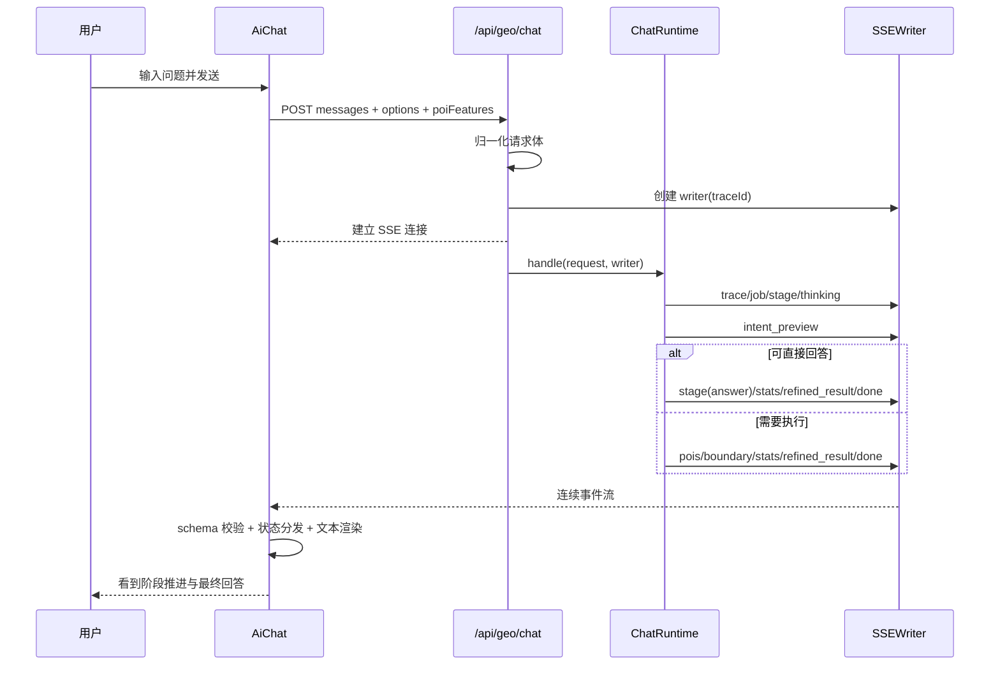

本页聚焦 **GeoLoom Agent 中一次聊天请求如何从前端输入、经由后端路由与运行时分发、再以 SSE 事件流回到前端并完成状态收敛**。范围严格限定在“请求生命周期管理”本身：即请求归一化、运行时入口、SSE 事件协议、前端流式消费、消息状态更新与完成/失败收尾，而不展开具体技能实现、空间分析算法细节或证据可视化组件设计。对于高级开发者，理解这条链路的关键在于：**系统并不把“回复”视为单一字符串，而是把一次请求建模为一串具备类型契约的事件序列**。Sources: [chat.ts](backend/src/routes/chat.ts#L25-L91), [app.ts](backend/src/app.ts#L17-L68), [SSEWriter.ts](backend/src/chat/SSEWriter.ts#L3-L115), [aiService.ts](src/utils/aiService.ts#L367-L593)

## 一、先从第一性原理理解：这里的“请求”其实是一个事件驱动状态机

从架构上看，这条链路由三层责任组成：**入口层**负责把 HTTP POST 请求规范化并升级为统一的 `ChatRequestV4`；**执行层**负责选择具体运行时并持续产出结构化 SSE 事件；**消费层**负责验证事件 schema、更新会话消息状态，并在 UI 上逐步呈现文本、阶段和元数据。也就是说，请求生命周期的核心不是“调用一次接口拿到回答”，而是“以 traceId 贯穿的一次增量状态推进”。Sources: [chat.ts](backend/src/routes/chat.ts#L25-L91), [SurfaceChatRuntime.ts](backend/src/chat/SurfaceChatRuntime.ts#L12-L39), [geoloomApi.ts](src/lib/geoloomApi.ts#L34-L112), [useAiStreamDispatcher.ts](src/composables/ai/useAiStreamDispatcher.ts#L85-L575)

在后端接口层，`/api/geo/chat` 会先将旧字段形态如 `message`、`query`、`userQuery`、`request_id`、`session_id` 归一化成统一的 `ChatRequestV4` 结构，然后为当前请求生成或继承 `traceId`，再通过 `PassThrough` 将 HTTP 响应升级为 `text/event-stream`。这说明生命周期的起点不是运行时本身，而是 **请求兼容层 + 流输出通道的建立**。Sources: [chat.ts](backend/src/routes/chat.ts#L9-L60), [chat.ts](backend/src/routes/chat.ts#L63-L91)

```mermaid
flowchart LR
    A[用户输入] --> B[AiChat 组织 messages/options]
    B --> C[POST /api/geo/chat]
    C --> D[normalizeChatRequestBody]
    D --> E[创建 PassThrough + SSEWriter]
    E --> F[SurfaceChatRuntime.handle]
    F --> G[具体 ChatRuntime 执行]
    G --> H[连续写出 SSE 事件]
    H --> I[前端解析与 schema 校验]
    I --> J[dispatchMetaEvent / 文本增量渲染]
    J --> K[消息最终收敛 complete 或 error]
```


Sources: [AiChat.vue](src/components/AiChat.vue#L688-L899), [chat.ts](backend/src/routes/chat.ts#L63-L91), [SurfaceChatRuntime.ts](backend/src/chat/SurfaceChatRuntime.ts#L18-L31), [aiService.ts](src/utils/aiService.ts#L377-L593)

## 二、请求入口：前端如何构造一次可追踪的调用

在 `AiChat.vue` 中，`sendMessage` 是生命周期的前端起点。它先把用户文本压入本地消息列表，再立即创建一个空的 assistant 消息占位，并将其标记为 `isThinking: true`、`isStreaming: true`、`pipelineStage: 'intent'`。这一步非常关键：**UI 并不等待网络返回后再创建 AI 消息，而是预先创建一个“将被流式填充的运行容器”**，后续所有事件都回写到这个索引位置。Sources: [AiChat.vue](src/components/AiChat.vue#L688-L757)

随后，前端会构造 `spatialContext`、标准化 `regions`、标准化 `selectedCategories`，并将大量请求控制项打包到 `options` 中，例如 `requestId`、`sessionId`、`skipCache`、`forceRefresh`、`globalAnalysis`、`sourcePolicy`、`analysisDepth` 等。这说明生命周期中“请求输入”并非只有自然语言消息，还包括一整组 **运行策略元数据**，它们共同决定后端本轮执行的上下文与行为。Sources: [AiChat.vue](src/components/AiChat.vue#L786-L867), [types.ts](backend/src/chat/types.ts#L10-L27)

从类型定义看，后端接受的 `ChatRequestV4` 由 `messages`、可选 `poiFeatures` 以及 `options` 组成；而 `options` 又明确支持 `requestId`、`sessionId`、`surface`、`spatialContext`、`regions`、`selectedCategories`、`sourcePolicy`、`skipCache`、`forceRefresh` 等扩展键。这意味着请求生命周期的输入模型本身就是面向多表面、多上下文、多策略的统一契约，而非单一聊天文本。Sources: [types.ts](backend/src/chat/types.ts#L8-L27)

## 三、后端入口与路由归一化：HTTP 请求如何被升级为流

`registerChatRoutes` 在 `/api/geo/chat` 上注册 POST 路由。收到请求后，它首先调用 `normalizeChatRequestBody`：如果调用方仍使用旧式 `message/query/userQuery` 语义，系统会自动折叠为 `messages: [{ role: 'user', content }]`；如果 `requestId/sessionId` 放在顶层，也会迁移进 `options`。这一步的价值在于 **为整个生命周期建立稳定的内部表示，避免执行层承受兼容性负担**。Sources: [chat.ts](backend/src/routes/chat.ts#L20-L60), [chat.ts](backend/src/routes/chat.ts#L69-L71)

归一化之后，路由层生成 `traceId`，创建 `PassThrough` 流与 `writer`，并设置标准 SSE 响应头：`Content-Type: text/event-stream`、`Cache-Control: no-cache, no-transform`、`Connection: keep-alive`，同时通过 `X-Trace-Id` 将跟踪标识回传给前端。然后它立即 `reply.send(stream)`，再异步执行 `deps.chat.handle(body, writer)`。这意味着连接先建立、执行后发生，保证后端能够在长运行过程中持续向客户端推送事件。Sources: [chat.ts](backend/src/routes/chat.ts#L71-L89)

更上层的 `createApp` 则将聊天路由挂载到 `/api/geo` 前缀下，并通过依赖注入方式提供 `ChatRuntime`。因此生命周期并不是被路由硬编码到某个实现里，而是由 `ChatRuntime` 这一接口抽象承载：任何符合 `createWriter` 与 `handle` 契约的运行时都可接入同一生命周期框架。Sources: [app.ts](backend/src/app.ts#L17-L21), [app.ts](backend/src/app.ts#L55-L64)

## 四、运行时分发：一次请求如何选择具体执行面

`SurfaceChatRuntime` 是请求生命周期中的 **表面路由器**。它读取 `request.options?.surface`，若值被标准化为 `narrative`，则将请求交给 `narrativeRuntime`，否则交给 `defaultRuntime`。同时它统一用 `SSEWriter` 包装输出，并将 schema 版本标记为 `v4.surface.v1`。这说明运行时选择发生在请求已经进入流式生命周期之后，但在具体业务执行之前。Sources: [SurfaceChatRuntime.ts](backend/src/chat/SurfaceChatRuntime.ts#L8-L31)

这种设计的意义在于：**请求生命周期的骨架被固定，而执行面可替换**。也就是说，“流式协议、trace 传播、前端消费方式”是稳定层；“默认问答面”与“叙事面”等只是接在稳定骨架后的不同 runtime。对于扩展者而言，只要实现 `ChatRuntime.handle(request, writer)`，即可接入整个生命周期，而无需重新设计传输协议。Sources: [app.ts](backend/src/app.ts#L17-L31), [SurfaceChatRuntime.ts](backend/src/chat/SurfaceChatRuntime.ts#L12-L39)

## 五、SSEWriter：后端如何把执行过程编码为协议事件

`SSEWriter` 是请求生命周期里最核心的协议组件。它为不同阶段输出定义了显式方法，如 `trace`、`job`、`stage`、`thinking`、`reasoning`、`intentPreview`、`pois`、`boundary`、`spatialClusters`、`vernacularRegions`、`fuzzyRegions`、`stats`、`webSearch`、`entityAlignment`、`message`、`refinedResult`、`done`、`error`。每次写入最终都会被编码为标准 SSE block：`event: <name>\ndata: <json>\n\n`。Sources: [SSEWriter.ts](backend/src/chat/SSEWriter.ts#L9-L115)

更重要的是，`SSEWriter` 会在对象型 payload 上自动补充 `trace_id` 与 `schema_version`。这使得请求生命周期中的每个关键事件都天然带有 **跨层追踪信息** 与 **协议版本信息**，前端不必依赖外部上下文即可判断事件归属与解释方式。数组型 payload 则保持原状，例如 `pois`、`vernacular_regions`、`fuzzy_regions`。Sources: [SSEWriter.ts](backend/src/chat/SSEWriter.ts#L99-L113)

下表总结了当前生命周期中最关键的 SSE 事件语义：

| 事件名 | 生命周期作用 | 典型 payload 结构 | 前端主要用途 |
|---|---|---|---|
| `trace` | 建立追踪上下文 | `request_id/version/trace_id/schema_version` | 绑定 traceId、故障排查 |
| `job` | 声明本轮任务模式 | `mode` | 展示运行模式 |
| `stage` | 推进阶段状态机 | `name` | 更新 pipeline 阶段 |
| `thinking` | 更新思考态提示 | `status/message` | 显示“正在识别/组织结果”等 |
| `intent_preview` | 暴露早期意图解析结果 | 锚点、类别、置信度、澄清提示 | 早期 UI 提示 |
| `pois` | 返回 POI 列表 | 数组 | 填充候选结果 |
| `boundary` / `partial` | 返回空间边界或预览 | 对象 | 提前渲染地图几何 |
| `stats` | 返回统计与性能信息 | 对象 | 更新分析指标 |
| `refined_result` | 返回最终聚合结果 | `answer/results/intent` | 生成最终回答与证据状态 |
| `done` | 正常结束 | `duration_ms` | 标记完成 |
| `error` | 失败结束 | `message` | 抛错并结束本轮 |

Sources: [SSEWriter.ts](backend/src/chat/SSEWriter.ts#L18-L113), [sseEventSchema.ts](shared/sseEventSchema.ts#L54-L212)

## 六、事件契约：前后端如何共享同一份 SSE schema

`shared/sseEventSchema.ts` 定义了共享的 SSE 事件 schema。它不仅为 `job`、`stage`、`thinking`、`reasoning`、`intent_preview`、`progress`、`partial`、`pois`、`boundary`、`spatial_clusters`、`vernacular_regions`、`fuzzy_regions`、`stats`、`web_search`、`entity_alignment`、`refined_result`、`error`、`done`、`schema_error` 建立结构约束，还会通过 `withEventMeta` 自动把 `trace_id`、`schema_version`、`capabilities` 加入对象型 schema。Sources: [sseEventSchema.ts](shared/sseEventSchema.ts#L21-L54), [sseEventSchema.ts](shared/sseEventSchema.ts#L54-L212)

这份共享 schema 使请求生命周期具备一个关键属性：**事件流不是“约定俗成的 JSON”，而是可验证的协议**。前端在消费事件时会调用 `validateSSEEventPayload`；如果 payload 不符合当前事件的 schema，前端不会直接信任它，而是生成一个 `schema_error` 分支处理路径。这一机制降低了流式协议演进时前后端漂移带来的风险。Sources: [geoloomApi.ts](src/lib/geoloomApi.ts#L34-L53), [aiService.ts](src/utils/aiService.ts#L470-L495), [sseEventSchema.ts](shared/sseEventSchema.ts#L238-L332)

## 七、一个可验证的后端执行样本：DeterministicGeoChat 的完整事件序列

`DeterministicGeoChat` 展示了一个完整、清晰的后端生命周期样本。它在 `handle` 中按顺序发出：`trace` → `job` → `stage(intent)` → `thinking(start)` → `intent_preview`。若意图不支持或锚点不足，则直接转入 `respondWithoutExecution`，输出 `stage(answer)`、`thinking(end)`、`stats`、`refined_result`、`done` 并结束；若意图可执行，则继续解析锚点、执行 SQL、生成证据，再输出 `pois` → `stage(answer)` → `thinking(end)` → `stats` → `refined_result` → `done`。这说明一次请求的“正常完成”是 **由多个语义事件收敛到最终结果**，而不是一次性返回。Sources: [DeterministicGeoChat.ts](backend/src/chat/DeterministicGeoChat.ts#L70-L123), [DeterministicGeoChat.ts](backend/src/chat/DeterministicGeoChat.ts#L126-L236), [DeterministicGeoChat.ts](backend/src/chat/DeterministicGeoChat.ts#L238-L260)

尤其值得注意的是，`refined_result` 并不只是“最终文本”，而是聚合了 `answer`、`results.pois`、`results.stats`、`results.intentMeta`、顶层 `intent` 与 `trace_id`。这使前端可以把最终回答、证据、统计和意图元数据作为一个一致快照来处理，从而让请求生命周期在末端具备 **最终一致性收敛点**。Sources: [DeterministicGeoChat.ts](backend/src/chat/DeterministicGeoChat.ts#L348-L379)


Sources: [chat.ts](backend/src/routes/chat.ts#L69-L89), [DeterministicGeoChat.ts](backend/src/chat/DeterministicGeoChat.ts#L70-L236), [SSEWriter.ts](backend/src/chat/SSEWriter.ts#L18-L113), [AiChat.vue](src/components/AiChat.vue#L868-L962)

## 八、前端流式消费：sendChatMessageStream 如何把 SSE 还原为状态增量

在前端，`sendChatMessageStream` 通过 `fetch` 调用 `/chat` 接口，并从响应头获取 `X-Trace-Id`。然后它使用 `ReadableStreamDefaultReader` 逐块读取响应体，手动解析 SSE 行：识别 `event:` 行记录当前事件类型，再对随后的 `data:` 行进行 JSON 解析。这一实现说明系统没有依赖浏览器原生 `EventSource`，而是采用了 **POST + fetch + 自管 SSE 解析** 的模型，以便携带复杂请求体。Sources: [aiService.ts](src/utils/aiService.ts#L377-L425), [aiService.ts](src/utils/aiService.ts#L448-L587)

对于元事件，前端使用 `META_EVENT_TYPES` 白名单进行分类处理。如果事件在白名单中，则先做 schema 校验；校验失败时不会照常派发，而是转成 `schema_error` 通知上层。若校验通过，则调用 `onMeta(eventType, payload)`。对于 `refined_result`，前端还会从其中的 `answer` 字段提取最终文本并通过 `onChunk` 注入文本渲染链路；对于 `error`，则直接抛出异常终止本轮请求。Sources: [aiService.ts](src/utils/aiService.ts#L106-L113), [aiService.ts](src/utils/aiService.ts#L467-L543)

文本块与元事件是并行消费的。若后端发送的是普通 `message` 形态或兼容 OpenAI 的 `choices[].delta.content`，前端会将其中的文本增量提取出来，经过去除思维链标签与推理片段抑制逻辑后，再交给 `onChunk`。因此，生命周期中的“文本响应”只是其中一种输出通道，而 **结构化元事件与文本增量共享同一条 SSE 传输管道**。Sources: [aiService.ts](src/utils/aiService.ts#L429-L446), [aiService.ts](src/utils/aiService.ts#L547-L592)

## 九、消息状态分发：事件如何映射到 UI 状态机

`useAiStreamDispatcher` 是前端请求生命周期中的状态归并器。它接收 `(type, data, aiMessageIndex)`，然后把后端事件映射到当前 assistant 消息对象上。例如：`trace` 绑定 `traceId`，`thinking` 更新 `isThinking/thinkingMessage`，`intent_preview` 更新意图预览与提示文案，`stage` 推进阶段，`pois`、`boundary`、`spatial_clusters`、`vernacular_regions`、`fuzzy_regions`、`stats` 分别更新对应空间或分析数据，`refined_result` 则作为最终聚合快照写回消息并触发多个 UI 事件。Sources: [useAiStreamDispatcher.ts](src/composables/ai/useAiStreamDispatcher.ts#L229-L390), [useAiStreamDispatcher.ts](src/composables/ai/useAiStreamDispatcher.ts#L392-L575)

尤其在 `refined_result` 分支中，分发器会调用 `normalizeRefinedResultEvidence` 对最终结果做归一化，然后把 `boundary`、`spatialClusters`、`vernacularRegions`、`fuzzyRegions`、`analysisStats`、`modelTiming`、`intent`、`toolCalls` 一次性写入消息对象，并额外向外层发出 `ai-boundary`、`ai-spatial-clusters`、`ai-vernacular-regions`、`ai-fuzzy-regions`、`ai-analysis-stats`、`ai-intent-meta` 等事件。这表明请求生命周期的末端不是单点更新，而是 **以一个最终聚合包驱动多路前端状态同步**。Sources: [useAiStreamDispatcher.ts](src/composables/ai/useAiStreamDispatcher.ts#L242-L268), [useAiStreamDispatcher.ts](src/composables/ai/useAiStreamDispatcher.ts#L478-L480)

若收到 `schema_error`，分发器不会中断主流程，而是把错误摘要记录为 `schemaWarning` 并附加到消息事件列表中。这体现了该生命周期对协议不一致的处理策略：**可观测、可降级，但不默认中止**。Sources: [useAiStreamDispatcher.ts](src/composables/ai/useAiStreamDispatcher.ts#L555-L566)

## 十、文本渲染与事件渲染是两条并行子生命周期

`AiChat.vue` 中的 `sendMessage` 把 `sendChatMessageStream` 的第四个参数作为元事件回调，而第二个参数则专门接收文本 chunk。文本 chunk 进入 `enqueueStreamChunk` 后不会立即整段写入消息，而是进入一个本地队列，再按字符节流地逐步追加到 `currentMessage.content` 中。这使 UI 能够产生更平滑的“打字机式”输出效果。Sources: [AiChat.vue](src/components/AiChat.vue#L521-L600), [AiChat.vue](src/components/AiChat.vue#L868-L899)

与之并行，元事件回调会立即调用 `dispatchMetaEvent`，因此阶段推进、思考提示、边界预览、统计信息等结构化状态通常会比最终文本更早可见。这是一种非常清晰的生命周期设计：**文本是慢速表层渲染，元事件是高速状态同步**。Sources: [AiChat.vue](src/components/AiChat.vue#L877-L898), [useAiStreamDispatcher.ts](src/composables/ai/useAiStreamDispatcher.ts#L270-L575)

## 十一、生命周期的收尾：成功、失败与最终状态收敛

在 `AiChat.vue` 中，请求生命周期以 `try/catch/finally` 结构收尾。若 `sendChatMessageStream` 顺利完成，组件会等待流式文本队列排空，并将 `requestSucceeded` 置为 `true`；若出现异常，则先 `flushStreamQueue`，再把错误消息附加到当前 assistant 消息，且将消息标记为 `error`。Sources: [AiChat.vue](src/components/AiChat.vue#L899-L922)

真正的生命周期收敛发生在 `finally` 中。这里组件调用 `resolveStreamFinalState({ requestSucceeded })`，把消息的 `isStreaming`、`isThinking`、`thinkingMessage`、`runCompletedAt`、`pipelineStage`、`pipelineCompleted` 统一归档：成功时进入“分析已经完成”并把阶段收束到 `answer`；失败时进入“请求已中断”。这意味着系统将“流结束”与“UI 状态闭合”明确区分，避免前端状态遗留在中间阶段。Sources: [AiChat.vue](src/components/AiChat.vue#L923-L962), [streamFinalState.ts](src/utils/streamFinalState.ts#L1-L23)

同时，最终消息中的 `traceId` 和 `intentMeta` 还会被送入 `trackSessionOutcome` 做会话结果记录。虽然这属于观测行为，但在生命周期层面它说明：**请求完成并不止于 UI，系统还会在终点做结果上报**。Sources: [AiChat.vue](src/components/AiChat.vue#L946-L954)

## 十二、生命周期中的关键设计模式对照

下表总结本页范围内可验证的请求生命周期设计模式：

| 设计点 | 代码体现 | 作用 | 结果 |
|---|---|---|---|
| 请求归一化 | `normalizeChatRequestBody` | 兼容旧字段输入 | 降低调用方耦合 |
| 流先建立后执行 | `reply.send(stream)` 后 `chat.handle()` | 提前打开 SSE 通道 | 支持长时任务早反馈 |
| 运行时抽象 | `ChatRuntime` 接口 + `SurfaceChatRuntime` | 解耦生命周期骨架与执行面 | 易于扩展不同 surface |
| 事件化输出 | `SSEWriter` | 把执行过程编码为 typed events | 支持渐进式 UI |
| 共享 schema 校验 | `shared/sseEventSchema.ts` | 约束协议一致性 | 降低前后端漂移风险 |
| 文本/元事件双通道 | `onChunk` + `onMeta` | 分离表现层与结构状态 | 早反馈且可视状态更完整 |
| 最终快照收敛 | `refined_result` | 聚合 answer + stats + intent | 便于前端一次性同步 |
| finally 统一收尾 | `resolveStreamFinalState` | 闭合状态机 | 防止悬挂中的消息状态 |

Sources: [chat.ts](backend/src/routes/chat.ts#L25-L91), [app.ts](backend/src/app.ts#L17-L68), [SSEWriter.ts](backend/src/chat/SSEWriter.ts#L18-L115), [sseEventSchema.ts](shared/sseEventSchema.ts#L54-L212), [aiService.ts](src/utils/aiService.ts#L367-L593), [AiChat.vue](src/components/AiChat.vue#L688-L962)

## 十三、与仓库结构对应的生命周期视图

为了便于代码考古，可以把本页涉及的请求生命周期代码定位为以下结构：

```text
backend/
└─ src/
   ├─ app.ts                        # ChatRuntime 抽象与路由挂载
   ├─ routes/chat.ts               # /api/geo/chat 入口、请求归一化、SSE 响应建立
   └─ chat/
      ├─ SurfaceChatRuntime.ts     # surface 分发
      ├─ SSEWriter.ts              # SSE 事件编码
      ├─ DeterministicGeoChat.ts   # 可验证的事件序列样本
      └─ types.ts                  # 请求契约

shared/
└─ sseEventSchema.ts               # 前后端共享事件 schema

src/
├─ components/AiChat.vue           # 请求发起、assistant 占位、最终收尾
├─ utils/aiService.ts              # fetch + SSE 解析 + onChunk/onMeta 分流
└─ composables/ai/useAiStreamDispatcher.ts
                                 # 元事件分发到消息状态
```
Sources: [app.ts](backend/src/app.ts#L17-L68), [chat.ts](backend/src/routes/chat.ts#L25-L91), [SSEWriter.ts](backend/src/chat/SSEWriter.ts#L3-L115), [DeterministicGeoChat.ts](backend/src/chat/DeterministicGeoChat.ts#L51-L379), [sseEventSchema.ts](shared/sseEventSchema.ts#L1-L332), [AiChat.vue](src/components/AiChat.vue#L688-L962), [aiService.ts](src/utils/aiService.ts#L360-L593), [useAiStreamDispatcher.ts](src/composables/ai/useAiStreamDispatcher.ts#L85-L575)

## 十四、阅读建议：从本页向外延伸的最合理顺序

如果你已经理解本页的请求生命周期，下一步最自然的阅读顺序是先看 [API 路由设计：RESTful 与 SSE 流式传输](22-api-lu-you-she-ji-restful-yu-sse-liu-shi-chuan-shu)，以从接口设计角度理解聊天入口与流协议边界；随后看 [智能体编排：技能调度与任务执行](20-zhi-neng-ti-bian-pai-ji-neng-diao-du-yu-ren-wu-zhi-xing)，以理解 `handle(request, writer)` 背后的任务编排；再看 [AI 聊天组件：流式对话与上下文绑定](17-ai-liao-tian-zu-jian-liu-shi-dui-hua-yu-shang-xia-wen-bang-ding)，以从组件交互角度观察同一生命周期如何映射到用户体验。Sources: [app.ts](backend/src/app.ts#L17-L68), [AiChat.vue](src/components/AiChat.vue#L688-L962), [SurfaceChatRuntime.ts](backend/src/chat/SurfaceChatRuntime.ts#L12-L39)