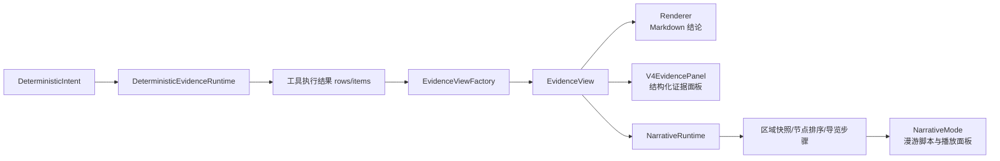
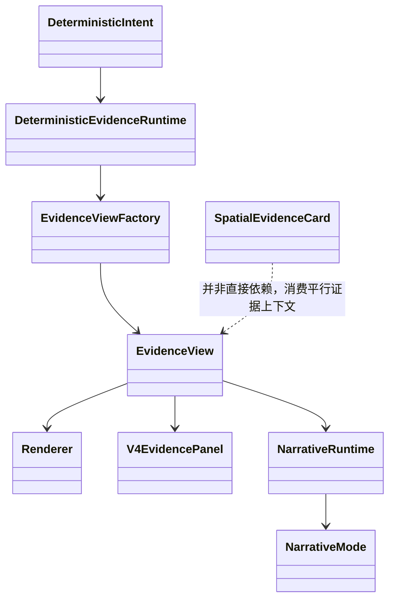

本页只讨论 GeoLoom Agent 中**证据如何被组织成结构化视图、如何被渲染为面向用户的文本与卡片，以及叙事模式如何把空间证据转化为可播放的区域导览骨架**。从实现上看，这一层不是“单纯展示 UI”，而是连接后端证据视图工厂、Markdown 渲染器、前端证据面板与叙事视图的**证据表达层**：后端先把不同查询意图归约为统一 `EvidenceView` 契约，再分别进入普通证据展示路径或 narrative 叙事路径。Sources: [types.ts](backend/src/chat/types.ts#L313-L368) [EvidenceViewFactory.ts](backend/src/evidence/EvidenceViewFactory.ts#L9-L67) [Renderer.ts](backend/src/evidence/Renderer.ts#L492-L598) [NarrativeRuntime.ts](backend/src/narrative/NarrativeRuntime.ts#L160-L190)

## 核心结论：证据表达层的第一性原理

从第一性原理看，这套系统把“证据生成与可视化”拆成三个稳定问题：**一是证据结构化**，即将查询结果折叠为统一的 `EvidenceView`；**二是证据叙述化**，即把 `EvidenceView` 渲染为 Markdown 结论、分段说明或叙事脚本；**三是证据交互化**，即在前端将证据绑定到卡片、详情、定位按钮、播放步骤与 trace 面板。这里最关键的架构特征是：**UI 并不直接解释原始工具输出，而是消费中间层证据模型**，因此查询类型扩展主要落在 view builder 与 renderer，而不是散落在多个组件里。Sources: [types.ts](backend/src/chat/types.ts#L321-L348) [EvidenceViewFactory.ts](backend/src/evidence/EvidenceViewFactory.ts#L10-L67) [V4EvidencePanel.vue](src/components/V4EvidencePanel.vue#L155-L200)

## 架构总览

在阅读下面 Mermaid 图之前，需要先明确三个对象的职责：`DeterministicIntent` 决定查询意图，`EvidenceView` 是统一证据契约，`NarrativeRuntime` 则在 narrative surface 下把区域证据进一步编排成导览步骤。普通问答和叙事模式共享部分证据构建能力，但最终展示出口不同。Sources: [types.ts](backend/src/chat/types.ts#L54-L81) [Renderer.ts](backend/src/evidence/Renderer.ts#L492-L598) [NarrativeRuntime.ts](backend/src/narrative/NarrativeRuntime.ts#L4-L25)

Sources: [DeterministicEvidenceRuntime.ts](backend/src/evidence/DeterministicEvidenceRuntime.ts#L27-L83) [EvidenceViewFactory.ts](backend/src/evidence/EvidenceViewFactory.ts#L9-L67) [Renderer.ts](backend/src/evidence/Renderer.ts#L492-L598) [NarrativeRuntime.ts](backend/src/narrative/NarrativeRuntime.ts#L27-L61) [NarrativeMode.vue](src/views/NarrativeMode.vue#L58-L88)

## 统一证据模型：`EvidenceView` 是后端与前端之间的表达契约

`EvidenceView` 定义了证据展示层可依赖的稳定字段：基础部分包括 `type`、`anchor`、`items`、`meta`，扩展部分覆盖对比结果 `pairs`、聚合桶 `buckets`、语义相似区域 `regions`、区域概览专属的 `areaProfile`、`hotspots`、`anomalySignals`、`opportunitySignals`、`aoiContext`、`landuseContext`、`regionFeatures`、`representativePoiProfiles` 等。这意味着前端组件并不需要知道后端是用 SQL、编码器还是聚合逻辑得到这些结果；它只需要消费已经归一化的视图对象。Sources: [types.ts](backend/src/chat/types.ts#L313-L348)

## 证据视图工厂：按意图选择表达模板，而不是按组件硬编码

`EvidenceViewFactory.create()` 的分派逻辑清楚地体现了“**意图决定证据形态**”的模式。`compare_places` 进入 `ComparisonView`，`similar_regions` 进入 `SemanticCandidateView`，`nearest_station` 进入 `TransportView`，`area_overview` 进入 `AreaOverviewView`；若目标大类是餐饮且结果数大于 1，则生成 `BucketView`；其余默认回落到 `POIListView`。这说明证据展示的核心切换点不是前端路由，而是后端根据查询语义提前完成模板选择。Sources: [EvidenceViewFactory.ts](backend/src/evidence/EvidenceViewFactory.ts#L10-L67)

## 证据视图类型对比

| 视图类型 | 触发条件 | 主要结构 | 主要用途 |
|---|---|---|---|
| `poi_list` | 默认附近 POI 查询 | `items`, `meta.radiusM`, `meta.scopeLabel` | 展示周边候选清单 |
| `transport` | `nearest_station` | 去重后的站点 `items` | 展示最近交通接驳 |
| `bucket` | 餐饮类且结果多项 | `items`, `buckets` | 展示聚合分布 |
| `comparison` | `compare_places` | `pairs`, `secondaryAnchor` | 双地点对比 |
| `semantic_candidate` | `similar_regions` | `regions`, `items` | 相似片区候选 |
| `area_overview` | `area_overview` | 区域画像、热点、异常、机会、AOI/用地上下文 | 片区综述与解释性回答 |

Sources: [EvidenceViewFactory.ts](backend/src/evidence/EvidenceViewFactory.ts#L19-L67) [POIListView.ts](backend/src/evidence/views/POIListView.ts#L31-L65) [TransportView.ts](backend/src/evidence/views/TransportView.ts#L30-L47) [BucketView.ts](backend/src/evidence/views/BucketView.ts#L14-L40) [ComparisonView.ts](backend/src/evidence/views/ComparisonView.ts#L14-L32) [SemanticCandidateView.ts](backend/src/evidence/views/SemanticCandidateView.ts#L14-L33)

## 区域概览是证据表达层最复杂的视图

`AreaOverviewView` 是这一页的核心，因为它不是简单列结果，而是把多源区域证据压缩成一个可解释对象。代码中可以验证的处理包括：标准化锚点与区域项、构建类别桶、从直方图构建聚合分布、从热点网格反推出代表样本名、提取 AOI 上下文与用地上下文。这说明“空间证据卡”并非只显示 POI 列表，而是围绕**区域主语、热点位置、功能结构、上下文语义**做二次组织。Sources: [AreaOverviewView.ts](backend/src/evidence/views/AreaOverviewView.ts#L25-L193)

## 区域热点不是静态标签，而是由网格与代表样本反推出来的可读锚点

热点构造逻辑中，系统先解析热点网格的 WKT polygon，再用点在面判断把代表性样本 POI 投影回该网格，最后优先用两个样本名生成诸如“某某、某某一带”的标签；如果没有样本，再回落为“热点网格1”这类通用命名。这个细节很重要：**热点名称是解释性命名，而不是数据库原始字段透传**，因此其目标是帮助用户把抽象网格映射回可认知地点。Sources: [AreaOverviewView.ts](backend/src/evidence/views/AreaOverviewView.ts#L76-L158)

## 渲染器的职责：把结构化证据转换成稳定的 Markdown 叙述段落

`Renderer` 并不参与证据发现，而是负责将 `EvidenceView` 变成最终的 Markdown 文本。其内部提供了统一的 section 构造函数，包括普通 bullet section、编号 section、段落 section；同时有类别标签人性化、距离格式化、语义归纳、AOI/用地语义推断、代表样本描述等帮助函数。换言之，证据“可视化”在这里同时包含了**文本可视化**：系统通过固定段落结构保证回答可读、可验证、可扩展。Sources: [Renderer.ts](backend/src/evidence/Renderer.ts#L4-L77) [Renderer.ts](backend/src/evidence/Renderer.ts#L239-L288)

## 区域概览渲染采用“结构化优先，证据不足时降级”的双路径

`Renderer.render()` 在 `area_overview` 分支中有明确的双层策略。如果视图中已经具备 `areaProfile`，且存在热点、异常信号或机会信号之一，就走 `buildStructuredAreaMarkdown()`；如果样本缺失或桶为空，则输出基础汇总；其余进入 `buildFallbackAreaMarkdown()`。这说明系统不会在证据不足时伪造高置信解释，而是显式降级到“基础样本汇总 + 建议补证据”的表达。该机制直接体现了页面要求中的**零猜测、基于可验证证据表达**。Sources: [Renderer.ts](backend/src/evidence/Renderer.ts#L554-L597) [Renderer.ts](backend/src/evidence/Renderer.ts#L378-L490)

## 区域回答的四段式组织方式

结构化区域 Markdown 被稳定地组织为四个 section：`区域主语`、`关键特征`、`热点与结构`、`机会与风险`。其中“区域主语”优先采用 `areaSubject` 的高置信标题，否则退回 AOI/用地语义推断，再不够时按锚点理解；“关键特征”会合并编码器提取的区域特征、代表 POI 角色、语义上下文与主导供给结构；“热点与结构”与“机会与风险”则接收热点、异常、机会信号与置信度尾注。这种固定骨架说明系统在文案层面追求的是**解释性一致性**，而不是每次自由发挥。Sources: [Renderer.ts](backend/src/evidence/Renderer.ts#L324-L356) [Renderer.ts](backend/src/evidence/Renderer.ts#L378-L438)

## 联网验证证据可以作为补充 section 追加，而不污染主结构

`Renderer` 还支持 `entity_alignment` 对齐结果的附加展示：当 `view.meta.entity_alignment` 存在且条目 `item.meta.verification` 可用时，会额外生成 `联网验证` section，仅列出 `dual_verified` 的高可信样本。这一设计说明系统把联网验证看作**补强证据层**，而不是与本地空间结构分析混为一谈；它通过独立 section 保持证据来源边界清晰。Sources: [Renderer.ts](backend/src/evidence/Renderer.ts#L290-L311) [Renderer.ts](backend/src/evidence/Renderer.ts#L554-L596)

## 后端执行层：确定性证据运行时为视图生成提供并行证据基础

`DeterministicEvidenceRuntime` 负责按 atom 依赖关系拓扑调度工具调用。它会缓存各 atom 结果、检查依赖是否完成、在依赖就绪后异步启动下游，并通过 SSE 写出 `tool_run` 与 thinking 状态。虽然这里不直接渲染 UI，但它决定了最终 `EvidenceView` 的原材料是否能按意图完整凑齐，因此它是“证据生成”而非“证据展示”的基础运行层。Sources: [DeterministicEvidenceRuntime.ts](backend/src/evidence/DeterministicEvidenceRuntime.ts#L27-L83) [DeterministicEvidenceRuntime.ts](backend/src/evidence/DeterministicEvidenceRuntime.ts#L127-L178)

## 前端 V4 证据面板：结构化证据与 trace 的双栏呈现

`V4EvidencePanel` 是后端 `EvidenceView` 在常规问答界面的直接可视化容器。左侧主卡片根据 `evidenceView.type` 展示列表项、对比卡片或语义区域卡片；右侧则展示 `toolCalls` trace，包括 `skill.action`、状态与耗时。顶部还会显示锚点、结果数、模型状态与降级依赖。这种布局表明该面板不是单纯“结果卡片”，而是**结果 + 执行透明度**的联合视图。Sources: [V4EvidencePanel.vue](src/components/V4EvidencePanel.vue#L1-L121) [V4EvidencePanel.vue](src/components/V4EvidencePanel.vue#L155-L199)

## V4 面板所支持的证据类型是后端视图类型的前端镜像

`viewTitleMap` 将 `poi_list`、`transport`、`bucket`、`comparison`、`semantic_candidate` 映射成“周边证据清单”“交通接驳证据”“聚合分桶证据”“双片区对比证据”“语义相似片区证据”。这不是另起一套枚举，而是前端对后端 `EvidenceViewType` 的直接消费。值得注意的是，当前映射中没有单独为 `area_overview` 定义标题，回落为“结构化证据”，这表明区域综述在普通证据面板中的展示更偏通用容器，而其深度表达主要由 Markdown renderer 与 narrative 模式承担。Sources: [V4EvidencePanel.vue](src/components/V4EvidencePanel.vue#L167-L176) [types.ts](backend/src/chat/types.ts#L313-L320)

## `SpatialEvidenceCard` 代表另一条前端证据卡路径：意图驱动模板看板

与 `V4EvidencePanel` 面向 `EvidenceView` 不同，`SpatialEvidenceCard` 主要消费聚类、俗称区域、模糊边界与分析统计等前端聚合上下文，通过 `deriveTemplateContext()` 与 `useIntentTemplateSelector()` 选出 1–3 个 widget 进行呈现。卡片头部会根据 `intentType` 标记“宏观意图 / 微观意图 / 对比意图”，并为每个 widget 提供 action 按钮，如定位或追问。这说明“空间证据卡”在前端存在两类实现：**一种是后端证据视图面板，另一种是前端模板式摘要卡**。Sources: [SpatialEvidenceCard.vue](src/components/SpatialEvidenceCard.vue#L1-L68) [SpatialEvidenceCard.vue](src/components/SpatialEvidenceCard.vue#L93-L124) [SpatialEvidenceCard.vue](src/components/SpatialEvidenceCard.vue#L152-L200)

## `SpatialEvidenceCard` 对编码器参与情况做了显式可视化

当 `analysisStats` 中出现 `boundary_signal_model` 包含 encoder，或存在 `encoder_region_predicted_count`、`encoder_region_high_confidence_count`、`encoder_region_purity`、`vector_constraint_source` 等字段时，组件会展示“编码器参与”摘要，包括预测数、高置信数、纯度与约束源。也就是说，证据卡不仅显示结果，还把**证据形成机制中的模型参与程度**暴露给用户。对应测试也验证了这些字段会被正确渲染。Sources: [SpatialEvidenceCard.vue](src/components/SpatialEvidenceCard.vue#L126-L150) [SpatialEvidenceCard.spec.js](src/components/__tests__/SpatialEvidenceCard.spec.js#L90-L110)

## `SpatialEvidenceCard` 的明细区强调“可定位”的证据消费方式

组件会从热点、片区和模糊区域中抽取少量 `detailRows`，并把它们做成可点击按钮；点击后通过 `locate` 事件发出中心坐标。这里的可视化重点不是铺满数据，而是把证据转化为**地图回跳锚点**。测试中也验证了点击“定位”类 action 会发出坐标事件。Sources: [SpatialEvidenceCard.vue](src/components/SpatialEvidenceCard.vue#L152-L187) [SpatialEvidenceCard.vue](src/components/SpatialEvidenceCard.vue#L189-L200) [SpatialEvidenceCard.spec.js](src/components/__tests__/SpatialEvidenceCard.spec.js#L75-L88)

## 前端对证据载荷做了归一化，以吸收 snake_case / camelCase 差异

`normalizeAiEvidencePayload()` 将 `clusters / spatialClusters / spatial_clusters`、`vernacularRegions / vernacular_regions`、`fuzzyRegions / fuzzy_regions` 统一到一个稳定结构，并且专门为模糊区域补足 `hierarchy` 与 `ambiguity`。`normalizeRefinedResultEvidence()` 则进一步整合 `boundary`、`spatialClusters`、`vernacularRegions`、`fuzzyRegions`、`stats`、`toolCalls`、`intent` 与 `hasEvidence`。这层归一化确保前端证据组件不必与后端命名风格强耦合。Sources: [aiEvidencePayload.ts](src/utils/aiEvidencePayload.ts#L17-L100) [refinedResultEvidence.ts](src/utils/refinedResultEvidence.ts#L13-L22) [refinedResultEvidence.ts](src/utils/refinedResultEvidence.ts#L169-L217)

## 叙事模式不是单独的“文案 UI”，而是区域证据的另一种编排出口

`NarrativeRuntime` 会读取 chat 请求中的 viewport，构造一个 `queryType: 'area_overview'` 的 `DeterministicIntent`，并把锚点标记为 `当前视口`、来源标记为 `map_view`，半径取视口对角线的一半且不少于 800 米。这个实现非常关键：它表明 narrative 模式本质上仍然建立在**区域概览证据模型**之上，只是把“回答”从静态 section 文本升级为“导览步骤 + 节点讲解”。Sources: [NarrativeRuntime.ts](backend/src/narrative/NarrativeRuntime.ts#L125-L190)

## narrative 运行时直接复用区域快照与区域特征能力

在依赖引入上，`NarrativeRuntime` 直接使用 `buildAreaOverviewView`、`buildRegionSnapshotFromEvidence`、`deriveRegionFeatureTags`、`summarizeRegionFeatures`、`buildPoiProfileInputFromEvidence` 等能力。这说明 narrative 并没有脱离证据系统另起一套数据模型，而是**复用 area_overview 证据，再向导览节点、角色、过渡与讲解文本提升**。Sources: [NarrativeRuntime.ts](backend/src/narrative/NarrativeRuntime.ts#L5-L12) [NarrativeRuntime.ts](backend/src/narrative/NarrativeRuntime.ts#L27-L41)

## 叙事视图中的“推荐理由卡”是空间证据的叙述化投影

`NarrativeMode.vue` 的播放面板展示当前镜头、层级标签、讲解文本、tagline、推荐理由卡、本地人提醒与网页来源。推荐理由卡固定包含“代表什么”“为什么值得去”“适合什么时候去”“和周边什么节点有关”四行信息；这说明 narrative 不是漫无边界的 prose，而是把空间节点证据压缩成一个**可播报、可理解、可回看的理由结构**。Sources: [NarrativeMode.vue](src/views/NarrativeMode.vue#L129-L183)

## narrative 交互围绕“导览骨架”而不是“自由聊天”组织

在 narrative 面板中，用户可以切换导览风格、生成导览骨架、开始漫游，并看到分步脚本。步骤区中每个 step 有 `focus`、`tierLabel` 与 `tagline`，播放面板则沿 `currentStepIndex` 逐步推进。这说明 narrative 模式的核心对象是**步骤化脚本**，而非普通问答消息流。前端模板文件中也保留了 `narrative_flow` 的 JSON schema 示例，要求每个节点提供 `focus`、`voice_text`、`duration`、`region_id`、`region_index`、`center`。Sources: [NarrativeMode.vue](src/views/NarrativeMode.vue#L39-L56) [NarrativeMode.vue](src/views/NarrativeMode.vue#L66-L87) [narrativeTextTemplate.ts](src/utils/narrativeTextTemplate.ts#L3-L42)

## 叙事模式还内置了事实净化机制，保证可播报内容不被营销文本污染

`NarrativeRuntime` 中存在针对广告营销词与文件伪影的过滤逻辑：包含营销中心、开盘、特惠、加盟等词的 snippet 会被剔除，文件名式内容也会被过滤；只有同时命中节点名称或标题的片段才可能保留。这说明 narrative 的“网页来源”不是原样拼接，而是经过**播报适配与可信净化**。Sources: [NarrativeRuntime.ts](backend/src/narrative/NarrativeRuntime.ts#L83-L109)

## Narrative Probe 体现了叙事证据链的可诊断性

`NarrativeProbe.vue` 提供了当前视口诊断工具，可查看 ranked 结果、候选池、品牌聚合、原始 representative samples、AOI 上下文、类别直方图与 encoder 信号。这不是最终用户页面，但它证明叙事模式的可视化不仅有最终播放 UI，也有一套**证据链调试视图**，可回看节点为何入选、品牌聚合是否生效、编码器是否参与。Sources: [NarrativeProbe.vue](src/views/NarrativeProbe.vue#L30-L60) [NarrativeProbe.vue](src/views/NarrativeProbe.vue#L102-L200)

## 模块交互关系

在阅读下图前，需要先区分两条出口：左侧是普通结构化证据展示，右侧是 narrative 叙事展示；二者共享证据构建，但后续渲染方式不同。Sources: [EvidenceViewFactory.ts](backend/src/evidence/EvidenceViewFactory.ts#L10-L67) [Renderer.ts](backend/src/evidence/Renderer.ts#L492-L598) [NarrativeRuntime.ts](backend/src/narrative/NarrativeRuntime.ts#L160-L190)

Sources: [DeterministicEvidenceRuntime.ts](backend/src/evidence/DeterministicEvidenceRuntime.ts#L27-L83) [EvidenceViewFactory.ts](backend/src/evidence/EvidenceViewFactory.ts#L9-L67) [V4EvidencePanel.vue](src/components/V4EvidencePanel.vue#L155-L199) [SpatialEvidenceCard.vue](src/components/SpatialEvidenceCard.vue#L82-L107)

## 证据生成与可视化中的关键模式对比

| 模式 | 输入 | 中间对象 | 输出形式 | 特点 |
|---|---|---|---|---|
| 结构化证据视图 | intent + rows/items | `EvidenceView` | 面板列表 / 对比 / 语义卡片 | 适合直接检视结果 |
| Markdown 证据叙述 | `EvidenceView` | section builder | 分段回答文本 | 适合问答响应 |
| 模板式空间证据卡 | clusters/regions/stats | template context | widget 卡片 + action | 强调摘要与定位操作 |
| 叙事导览模式 | viewport + area evidence | narrative steps | 漫游脚本 + 播放面板 | 强调顺序讲解与沉浸式导览 |
| 诊断探针模式 | viewport + probe result | ranked/candidates/raw | 调试表格与统计 | 面向开发验证 |

Sources: [Renderer.ts](backend/src/evidence/Renderer.ts#L26-L50) [V4EvidencePanel.vue](src/components/V4EvidencePanel.vue#L46-L121) [SpatialEvidenceCard.vue](src/components/SpatialEvidenceCard.vue#L11-L68) [NarrativeMode.vue](src/views/NarrativeMode.vue#L58-L125) [NarrativeProbe.vue](src/views/NarrativeProbe.vue#L39-L100)

## 面向高级开发者的实现观察

从代码考古视角看，这一页对应的实现呈现出一个清晰演进方向：系统已经从“原始工具结果展示”演进到“统一证据契约 + 多出口渲染”。其中 `EvidenceView` 是抽象层，`Renderer` 负责文本组织，`V4EvidencePanel` 负责结构化面板，`NarrativeRuntime + NarrativeMode` 负责叙事化出口，而 `SpatialEvidenceCard` 则代表另一支偏前端模板化的摘要路线。它们共同说明，GeoLoom Agent 把“证据可视化”理解为**结构化、可解释、可交互、可播放**的统一表达问题。Sources: [types.ts](backend/src/chat/types.ts#L321-L348) [Renderer.ts](backend/src/evidence/Renderer.ts#L492-L598) [SpatialEvidenceCard.vue](src/components/SpatialEvidenceCard.vue#L82-L107) [NarrativeRuntime.ts](backend/src/narrative/NarrativeRuntime.ts#L27-L61)

## 建议的后续阅读路径

如果你想继续沿当前主题向相邻能力深入，最合理的顺序是先看 [请求生命周期管理：从用户输入到流式响应](7-qing-qiu-sheng-ming-zhou-qi-guan-li-cong-yong-hu-shu-ru-dao-liu-shi-xiang-ying)，理解 `EvidenceView` 何时被生成；再看 [前端架构：Vue 3 + Vite + 地理可视化组件](9-qian-duan-jia-gou-vue-3-vite-di-li-ke-shi-hua-zu-jian)，理解证据面板如何嵌入 UI；若你关注 narrative 背后的服务组织，则继续看 [智能体编排：技能调度与任务执行](20-zhi-neng-ti-bian-pai-ji-neng-diao-du-yu-ren-wu-zhi-xing) 与 [API 路由设计：RESTful 与 SSE 流式传输](22-api-lu-you-she-ji-restful-yu-sse-liu-shi-chuan-shu)。Sources: [DeterministicEvidenceRuntime.ts](backend/src/evidence/DeterministicEvidenceRuntime.ts#L35-L83) [V4EvidencePanel.vue](src/components/V4EvidencePanel.vue#L1-L33) [NarrativeMode.vue](src/views/NarrativeMode.vue#L22-L57)