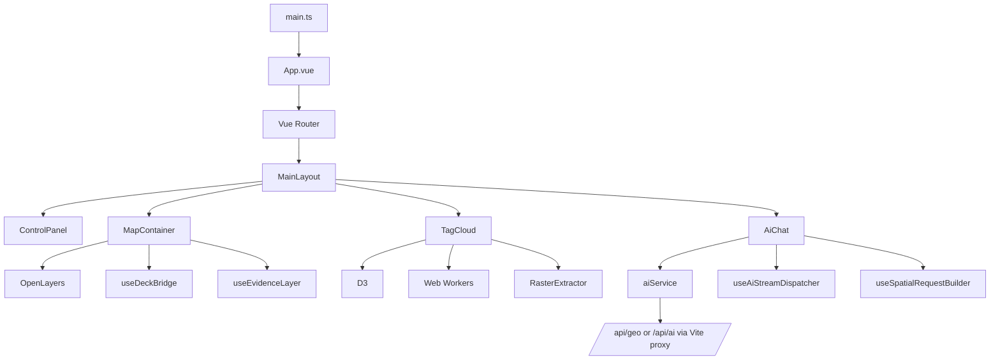
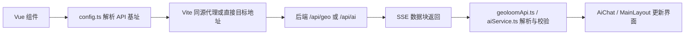

本页聚焦 GeoLoom Agent 的**前端应用壳、构建运行时、核心页面编排，以及地图/标签云/AI 面板三类关键可视化组件如何协同工作**。从代码结构可以验证，这一前端并非通用后台界面，而是围绕地理分析交互构建的单页应用：Vue 3 负责组件化界面与响应式状态，Vite 负责开发代理与产物分块，OpenLayers 承载二维地图与交互绘制，deck.gl 作为热力图增强层按需装载，D3 + Web Worker 负责标签云布局计算，AI 对话面板则作为独立异步组件接入地图上下文。阅读上，建议先结合 [架构概览：前端、后端与 AI 引擎协同](3-jia-gou-gai-lan-qian-duan-hou-duan-yu-ai-yin-qing-xie-tong) 建立系统边界，再进入 [地图容器与图层管理：地理可视化核心](16-di-tu-rong-qi-yu-tu-ceng-guan-li-di-li-ke-shi-hua-he-xin) 与 [AI 聊天组件：流式对话与上下文绑定](17-ai-liao-tian-zu-jian-liu-shi-dui-hua-yu-shang-xia-wen-bang-ding) 深读实现细节。 Sources: [package.json](package.json#L1-L89) [src/MainLayout.vue](src/MainLayout.vue#L226-L260) [src/router/index.ts](src/router/index.ts#L1-L33)

## 一、前端的第一性原理：它是“地图为中心”的单页分析工作台

从入口代码看，应用由 `createApp(App)` 启动，`App.vue` 本身只承载 `router-view`，说明真正的前端组织单位不是多层壳组件链，而是**路由页面级工作台**。根路由 `/` 直接挂载 `MainLayout`，其模板将左侧地图区、标签云区和右侧 AI 区放入统一布局，同时通过 `aiExpanded`、拖拽分割条、移动端头部等状态动态切换显示方式。因此，前端架构的中心不是“页面跳转”，而是**一个高交互、高状态密度的主分析界面**。 Sources: [src/main.ts](src/main.ts#L1-L31) [src/App.vue](src/App.vue#L1-L17) [src/router/index.ts](src/router/index.ts#L9-L33) [src/MainLayout.vue](src/MainLayout.vue#L1-L175)

这种设计直接决定了组件边界：`ControlPanel` 负责动作入口与参数切换，`MapContainer` 负责空间图层与地图事件，`TagCloud` 负责对 POI 集合做密集可视化，`AiChat` 负责把当前空间上下文转成 AI 可消费的会话请求。`MainLayout` 既不是纯展示层，也不是全局状态仓库，而是一个**编排器组件**，负责在这些能力模块之间转发 props、监听事件，并维护界面布局状态与跨组件协作时序。 Sources: [src/MainLayout.vue](src/MainLayout.vue#L44-L80) [src/MainLayout.vue](src/MainLayout.vue#L107-L175) [src/MainLayout.vue](src/MainLayout.vue#L177-L260)

## 二、项目结构总览：以组件、组合式逻辑、工具层三段分离

从 `src` 目录结构可见，前端代码按职责大致分成六层：入口与路由、视图/布局组件、可复用业务组件、组合式逻辑 `composables`、纯工具函数 `utils/lib/services`、以及浏览器 Worker。这里没有引入 Pinia/Vuex 之类集中式状态库，说明项目更偏向**“组合式局部状态 + 父组件编排”** 的架构，而不是全局单一状态树。 Sources: [src](src#L1-L48)

```text
src
├── main.ts / App.vue / router/
├── MainLayout.vue                # 主分析工作台
├── components/
│   ├── MapContainer.vue          # 地图交互核心
│   ├── TagCloud.vue              # 标签云可视化
│   ├── AiChat.vue                # AI 对话与结果渲染入口
│   └── ControlPanel.vue          # 操作与参数控制
├── composables/
│   ├── map/                      # 地图桥接与图层逻辑
│   └── useRegions.ts             # 多选区状态
├── utils/ / lib/ / services/     # API、契约、渲染、遥测等支撑逻辑
└── workers/                      # 标签布局与数据处理并行计算
```

这种分层方式的一个关键特征是：**地图和 AI 的复杂性被拆入 composables 与 utils，而不是持续堆积在模板层**。例如 `MapContainer` 依赖 `useDeckBridge`、`useEvidenceLayer`、`usePopupAnchor`、`useProjection` 等组合式模块，说明前端演进方向是将大型单文件组件中的专门能力逐步抽离成可测试、可重用逻辑单元。 Sources: [src/components/MapContainer.vue](src/components/MapContainer.vue#L169-L200) [src/composables/map/useDeckBridge.ts](src/composables/map/useDeckBridge.ts#L117-L200) [src/composables/map/useEvidenceLayer.ts](src/composables/map/useEvidenceLayer.ts#L1-L21)

## 三、整体架构关系图：主布局驱动三大前端子系统

在理解下面 Mermaid 图之前，需要先明确三个前端事实：第一，`MainLayout` 是协调中心；第二，地图、标签云、AI 面板都是可独立挂载的功能组件；第三，构建层通过 Vite 将它们按需加载与分块输出。基于这些已验证事实，可以把当前前端架构抽象为如下关系。 Sources: [src/MainLayout.vue](src/MainLayout.vue#L244-L258) [vite.config.js](vite.config.js#L40-L69)



这个结构体现出前端的核心设计模式：**UI 外壳统一，计算与渲染异构**。也就是说，Vue 负责生命周期和数据流，OpenLayers 负责地理底图与矢量交互，deck.gl 负责高密度热力叠加，D3 负责标签布局，Worker 负责把重计算移出主线程，AI 服务层负责把浏览器上下文转成后端请求。这是一个典型的“同一界面下多渲染引擎并存”的前端架构。 Sources: [src/components/MapContainer.vue](src/components/MapContainer.vue#L176-L199) [src/components/TagCloud.vue](src/components/TagCloud.vue#L47-L57) [src/components/AiChat.vue](src/components/AiChat.vue#L114-L143)

## 四、构建与运行时：Vite 不只是脚手架，而是前端分流与性能边界控制器

`package.json` 表明前端采用 Vue 3 + Vite 8，开发命令默认走 `dev:v4`，并与依赖服务、编码服务、后端服务并发启动。这意味着前端默认不是孤立开发，而是作为**完整空间分析栈的一部分**运行。与此同时，`vite.config.js` 显式区分 `v4`、`v3` 与默认模式，对代理目标进行模式化切换，前端开发时访问 `/api/geo`、`/api/ai`、`/api/category`、`/api/spatial`、`/api/search` 均可被转发到本地后端，从而避免前端代码硬编码跨域细节。 Sources: [package.json](package.json#L6-L45) [vite.config.js](vite.config.js#L12-L19) [vite.config.js](vite.config.js#L70-L105)

更重要的是，Vite 配置中存在显式的性能意图：一方面通过 `optimizeDeps.exclude` 排除 `three`、`@deck.gl/*` 等重包的预构建，另一方面在 `manualChunks` 中按技术域拆分 `vendor-ol`、`vendor-deckgl`、`vendor-d3`、`vendor-raster`、`vendor-turf` 等 chunk，并把 `NarrativeMode.vue` 额外抽成路由级产物。这说明前端架构不是简单依赖默认打包结果，而是**主动将地理库、三维库、栅格库、UI 库拆开，以降低首包压力并控制缓存粒度**。 Sources: [vite.config.js](vite.config.js#L31-L39) [vite.config.js](vite.config.js#L40-L69)

下表总结了当前构建层的关键策略。 Sources: [vite.config.js](vite.config.js#L12-L105) [package.json](package.json#L15-L45)

| 维度 | 实现方式 | 架构意义 |
|---|---|---|
| 开发服务器 | `vite --mode v4 --host 127.0.0.1` | 前端默认绑定 V4 后端协作模式 |
| API 代理 | `/api/geo`、`/api/ai` 等代理到 `proxyTarget` | 降低前端环境差异与跨域复杂度 |
| 依赖预构建 | 排除 `three`、`deck.gl` 重型依赖 | 减少开发期不必要预处理 |
| 手工分块 | `vendor-ol`、`vendor-deckgl`、`vendor-d3` 等 | 强化缓存复用与首屏控制 |
| 路由级拆分 | `NarrativeMode.vue` 单独 chunk | 非主路径能力延迟下载 |
| 预览端口 | `4173` | 与开发端口 `3000` 分离 |

## 五、入口与路由：极薄壳、重主工作台、少路由

前端入口 `main.ts` 仅完成三件事：创建 Vue App、挂载路由、移除首屏 loading 占位符。同时它没有全局注册大型插件，而是仅按需引入 Element Plus 组件样式。这是一个明显的**轻入口策略**：把启动负担压到最低，把复杂性留在业务组件的异步加载与内部模块化上。 Sources: [src/main.ts](src/main.ts#L1-L31)

路由层同样保持极简：`/` 指向 `MainLayout`，`/narrative` 与 `/narrative/probe` 懒加载叙事视图。对于本页主题而言，最关键的事实是主前端架构并未被拆成很多业务页面，而是把绝大部分核心能力集中在主工作台。这种路由结构更接近专业分析软件，而不是传统内容型网站。 Sources: [src/router/index.ts](src/router/index.ts#L4-L33)

## 六、主布局 MainLayout：前端编排核心

`MainLayout.vue` 在脚本层通过 `defineAsyncComponent` 懒加载 `MapContainer`、`TagCloud`、`AiChat`，并为每个组件提供加载占位符。模板层则将这三个核心子系统放入可伸缩布局中：地图面板默认常驻，标签云面板在 AI 展开时可隐藏，而 AI 面板仅在 `aiExpanded` 为真时显示，并可通过悬浮入口按钮再打开。这说明主布局的关键职责不是渲染细节，而是**按用户当前任务相位动态挂载重组件**。 Sources: [src/MainLayout.vue](src/MainLayout.vue#L214-L260) [src/MainLayout.vue](src/MainLayout.vue#L107-L175) [src/MainLayout.vue](src/MainLayout.vue#L177-L212)

从 props 和事件连线可验证 `MainLayout` 也是跨组件信息总线：它把 `mapPoiFeatures`、悬浮状态、用户位置、热力图开关等传给 `MapContainer`；把过滤后的标签数据、地图实例、算法参数、选区与权重开关传给 `TagCloud`；再把选中 POI、边界、多区、地图边界、用户定位状态等传给 `AiChat`。反向上，`MapContainer`、`TagCloud`、`AiChat` 通过事件把交互结果抛回 `MainLayout`，由后者进行状态同步与下一步编排。这是一种典型的**父级编排 + 子级专责**模式。 Sources: [src/MainLayout.vue](src/MainLayout.vue#L111-L131) [src/MainLayout.vue](src/MainLayout.vue#L155-L173) [src/MainLayout.vue](src/MainLayout.vue#L188-L210)

## 七、地图子系统：OpenLayers 为底座，deck.gl 为增强层

`MapContainer.vue` 直接引入 OpenLayers 的 `Map`、`View`、`TileLayer`、`VectorSource`、`Draw`、`Overlay` 以及样式对象，说明地图的主渲染与交互基础由 OpenLayers 承担。模板中包含地图容器、加载壳、POI 弹窗、过滤/热力图/权重控制，以及 AI 边界可信度图例，表明该组件并非纯地图画布，而是**地图交互与地图内 HUD 的统一承载体**。 Sources: [src/components/MapContainer.vue](src/components/MapContainer.vue#L1-L31) [src/components/MapContainer.vue](src/components/MapContainer.vue#L33-L130) [src/components/MapContainer.vue](src/components/MapContainer.vue#L169-L191)

脚本依赖进一步揭示其内部模块化方向：`useRegions` 管理多选区状态，`useProjection` 处理坐标投影，`usePopupAnchor` 负责弹窗锚点，`useDeckBridge` 负责接入 deck.gl 热力图运行时，`useEvidenceLayer` 负责 AI 证据边界图层。这意味着地图组件的内部复杂性已从“单一地图逻辑”演化为**底图、交互、叠加图层、证据可视化、弹窗定位、多区域管理**并存的复合系统。 Sources: [src/components/MapContainer.vue](src/components/MapContainer.vue#L192-L200)

`useDeckBridge.ts` 明确采用动态 `import('@deck.gl/core')` 和 `import('@deck.gl/aggregation-layers')` 加载运行时，并根据 OpenLayers 当前视图把中心、缩放、旋转转换为 deck.gl 的 `viewState`。这里最关键的架构点在于：**deck.gl 不是主地图引擎，而是挂载在地图容器之上的补充渲染层**，仅在热力图等需求下初始化，从而把高成本渲染延后到真正需要的时候。 Sources: [src/composables/map/useDeckBridge.ts](src/composables/map/useDeckBridge.ts#L117-L197)

`useEvidenceLayer.ts` 则负责将 AI 返回的边界、模糊区域、俗名区域等几何对象标准化为 ring，再映射成 OpenLayers `VectorLayer` 特征，并根据可信度划分图例桶位。由此可见，地图前端不仅画 POI，更承担了**AI 结果空间落图与可信度表达**的职责。这个模式连接了主分析工作台与 AI 输出视觉化之间的边界。 Sources: [src/composables/map/useEvidenceLayer.ts](src/composables/map/useEvidenceLayer.ts#L10-L21) [src/composables/map/useEvidenceLayer.ts](src/composables/map/useEvidenceLayer.ts#L76-L101) [src/composables/map/useEvidenceLayer.ts](src/composables/map/useEvidenceLayer.ts#L148-L200)

## 八、标签云子系统：D3 渲染 + Worker 计算 + 栅格权重增强

`TagCloud.vue` 不是简单的静态词云。它接收 `data`、`map`、`algorithm`、选区、边界、多边形中心、圆心、悬浮与点击状态，以及权重相关开关等属性，说明它本质上是**POI 集合在二维画布上的另一种空间表达层**，而不仅是文本装饰。模板中提供缩放控制、权重图例和空状态，进一步证明它被当作独立分析面板设计。 Sources: [src/components/TagCloud.vue](src/components/TagCloud.vue#L1-L44) [src/components/TagCloud.vue](src/components/TagCloud.vue#L63-L79)

其实现采用 D3，同时用 `?worker` 方式引入 `basic.worker`、`spiral.worker.ts`、`gravity.worker.ts`。组件代码明确说明 Worker 用于后台线程执行耗时布局，避免阻塞 UI 线程；并维护缩放行为、缓存布局结果、视口裁剪等优化状态。这表明前端在标签云这一层采用的是**主线程负责交互与 SVG，后台线程负责布局求解**的双层模型。 Sources: [src/components/TagCloud.vue](src/components/TagCloud.vue#L47-L57) [src/components/TagCloud.vue](src/components/TagCloud.vue#L171-L199)

标签云还接入 `RasterExtractor`，并通过 `weightEnabled`、`showWeightValue`、Jenks 近似分级、颜色图例等逻辑将 GeoTIFF 中的栅格值映射为 POI 权重颜色。`RasterExtractor.ts` 直接使用 `geotiff` 读取 `public/data/武汉POP.tif`，解析边界框、像元数据，并按经纬度提取每个 POI 的数值。由此可以验证，标签云不是单纯按词频布局，而是支持**将栅格型地理属性注入离散 POI 表达**。 Sources: [src/components/TagCloud.vue](src/components/TagCloud.vue#L81-L121) [src/components/TagCloud.vue](src/components/TagCloud.vue#L122-L169) [src/utils/RasterExtractor.ts](src/utils/RasterExtractor.ts#L36-L105) [src/utils/RasterExtractor.ts](src/utils/RasterExtractor.ts#L154-L199)

## 九、AI 面板子系统：对话界面不是孤立聊天框，而是空间上下文消费器

`AiChat.vue` 模板包含消息流、空状态、用户消息与助手消息卡片，以及底部输入区。更重要的是，它的 props 远超一般聊天组件：当前 POI、全域感知开关、边界多边形、绘制模式、圆心与半径、地图边界、地图缩放、用户位置、用户位置状态、所选类别以及多区 `regions` 都会传入。这说明 AI 面板不是“文本聊天 UI”，而是一个**带空间上下文的分析请求构造器**。 Sources: [src/components/AiChat.vue](src/components/AiChat.vue#L1-L26) [src/components/AiChat.vue](src/components/AiChat.vue#L145-L199)

脚本依赖进一步强化这一点：它同时使用 `useAiStreamDispatcher`、`useSpatialRequestBuilder`、`agentRunTimeline`、`analysisSignals`、`streamFinalState`、`aiAnchorFeature` 等模块，说明 AI 面板承担的职责包括流式事件分发、空间请求构造、阶段化运行状态展示、Markdown 渲染正规化、证据归一化与地图锚点提取。因此前端 AI 面板的架构定位更准确地说是**会话驱动的空间分析终端**。 Sources: [src/components/AiChat.vue](src/components/AiChat.vue#L114-L143)

在服务接入层，`aiService.ts` 根据 `VITE_BACKEND_VERSION` 判定 V3/V4 模式，定义元事件类型集合，并负责调用后端 API、处理流式响应、清理思考标签、验证 SSE 载荷。它从 `config.ts` 读取 API 基址，而 `config.ts` 会在开发环境优先将本地 API 基址折叠为空串，从而走同源代理。这说明 AI 功能接入不是组件直接 `fetch` 某个硬编码地址，而是经由**环境解析 → 服务封装 → SSE 协议校验**这一更稳定的前端服务层。 Sources: [src/utils/aiService.ts](src/utils/aiService.ts#L12-L16) [src/utils/aiService.ts](src/utils/aiService.ts#L101-L121) [src/utils/aiService.ts](src/utils/aiService.ts#L123-L200) [src/config.ts](src/config.ts#L24-L58)

## 十、控制面板：统一动作入口与跨端交互适配层

`ControlPanel.vue` 从模板即可看出它承担了明显的“入口聚合”职责：语义查询弹窗、移动端顶部栏、更多菜单、绘制多边形、绘制圆形、上传选区、渲染词云、初始化，以及实时过滤、热力图、标签权重、显示权重、全域感知等切换都集中在这里。它既服务桌面头部双面板，也服务移动端顶部与抽屉式菜单，因此它本质上是**交互指令集的展示与跨端适配层**。 Sources: [src/components/ControlPanel.vue](src/components/ControlPanel.vue#L1-L26) [src/components/ControlPanel.vue](src/components/ControlPanel.vue#L28-L55) [src/components/ControlPanel.vue](src/components/ControlPanel.vue#L56-L200)

这意味着前端架构在控制层做了明确分工：地图不直接承载全部业务按钮，AI 面板也不负责全局控制，而是由控制面板统一暴露操作，再把结果通过事件回传给 `MainLayout`。这样可以避免地图组件沦为“按钮 + 地图逻辑混杂”的巨型组件。 Sources: [src/MainLayout.vue](src/MainLayout.vue#L45-L80) [src/MainLayout.vue](src/MainLayout.vue#L83-L99)

## 十一、状态组织模式：局部状态为主，专门域状态抽离为 composable

当前前端未显示引入全局状态库，但存在若干可验证的状态组织策略。第一，大部分布局与交互状态存放在 `MainLayout`，如 AI 展开、拖拽、选中要素、边界、地图视图等；第二，领域独立且可复用的状态，如多选区，抽离为 `useRegions.ts`；第三，重渲染/重计算逻辑拆入 `composables/map` 和 `utils`。这说明项目采用的不是中心化仓库，而是**“页面编排状态 + 领域组合式状态 + 纯函数工具层”三段式组织**。 Sources: [src/MainLayout.vue](src/MainLayout.vue#L226-L260) [src/composables/useRegions.ts](src/composables/useRegions.ts#L61-L108)

`useRegions.ts` 提供了一个很清晰的例子。它定义 `Region` 类型、最多 6 个选区、颜色预设、POI 类别统计、添加/删除/清空/更新选区等接口，并将 `regions` 与 `activeRegionId` 置于模块级 `ref` 中。也就是说，多选区不是散落在组件内部的临时数组，而是被建模为一个可共享的前端领域状态容器。这是当前代码中少数具有“微型 store”特征的模块。 Sources: [src/composables/useRegions.ts](src/composables/useRegions.ts#L7-L37) [src/composables/useRegions.ts](src/composables/useRegions.ts#L50-L59) [src/composables/useRegions.ts](src/composables/useRegions.ts#L98-L189)

下表概括当前前端的状态分布方式。 Sources: [src/MainLayout.vue](src/MainLayout.vue#L107-L212) [src/composables/useRegions.ts](src/composables/useRegions.ts#L98-L242) [src/components/TagCloud.vue](src/components/TagCloud.vue#L171-L188)

| 状态类型 | 主要承载位置 | 典型内容 | 模式 |
|---|---|---|---|
| 应用布局状态 | `MainLayout.vue` | AI 面板展开、拖拽、面板宽度 | 父组件本地状态 |
| 地图交互状态 | `MapContainer.vue` + map composables | 绘制、悬浮、热力图、证据图层 | 组件状态 + 组合式抽离 |
| 多选区状态 | `useRegions.ts` | region 列表、活动选区、统计信息 | 领域 composable |
| 标签渲染状态 | `TagCloud.vue` | zoom、worker、layout cache、legend | 组件局部状态 |
| AI 会话状态 | `AiChat.vue` | messages、输入、流式过程、服务状态 | 组件局部状态 |
| API 基址状态 | `config.ts` | dev/prod API base 解析 | 环境配置函数 |

## 十二、前端性能策略：延迟加载、手工分块、Worker 并行、按需运行时

从现有代码可以明确验证四类性能策略。第一，`MainLayout` 对 `MapContainer`、`TagCloud`、`AiChat` 使用 `defineAsyncComponent`，重组件不在首屏同步打包执行；第二，Vite 对地图库、图表库、栅格库、UI 库做手工 chunk 分离；第三，`TagCloud` 将布局计算放入 Worker；第四，`useDeckBridge` 仅在需要时动态导入 deck.gl 运行时。这四个策略组合起来，形成了当前前端最重要的工程特征：**把“地理智能 UI”拆成按需激活的能力集合，而不是一次性加载的单体前端**。 Sources: [src/MainLayout.vue](src/MainLayout.vue#L244-L258) [vite.config.js](vite.config.js#L40-L69) [src/components/TagCloud.vue](src/components/TagCloud.vue#L190-L199) [src/composables/map/useDeckBridge.ts](src/composables/map/useDeckBridge.ts#L170-L197)

这一点也解释了为何入口层极薄、而主布局与组件边界较重：当前前端面对的是 OpenLayers、deck.gl、D3、GeoTIFF、Element Plus 等多技术栈并存场景，若不做延迟装载与边界拆分，首屏体积和交互阻塞都会显著放大。 Sources: [package.json](package.json#L46-L85) [vite.config.js](vite.config.js#L31-L39)

## 十三、组件能力对比：三大核心可视化组件各自解决什么问题

为了避免把前端理解为“一个大页面”，需要明确三大核心组件的能力边界。下表基于代码中可见的 props、依赖与职责做对比。 Sources: [src/components/MapContainer.vue](src/components/MapContainer.vue#L1-L165) [src/components/TagCloud.vue](src/components/TagCloud.vue#L1-L121) [src/components/AiChat.vue](src/components/AiChat.vue#L1-L109) [src/components/AiChat.vue](src/components/AiChat.vue#L145-L199)

| 组件 | 核心职责 | 主要技术 | 输入类型 | 输出方式 |
|---|---|---|---|---|
| `MapContainer` | 地图展示、绘制、图层叠加、边界证据可视化 | OpenLayers + deck.gl | POI、选区、用户位置、显示开关 | 地图事件、区域事件、悬浮/点击事件 |
| `TagCloud` | POI 文本布局与权重增强可视化 | D3 + Web Worker + GeoTIFF | POI 集合、算法、边界、权重开关 | 悬浮定位事件、图例显示 |
| `AiChat` | 流式对话、空间上下文分析、AI 结果交互 | Vue + SSE 服务封装 | 地图边界、POI、区域、定位状态 | 聊天事件、渲染到地图/标签云、AI 边界事件 |

从架构角度看，这种分工的价值在于：**同一组空间实体可被三个视角同时消费**——地图展示空间位置，标签云强化类别/权重感知，AI 面板生成叙事与分析结果。`MainLayout` 则把这三种视角统一到一套交互闭环中。 Sources: [src/MainLayout.vue](src/MainLayout.vue#L111-L173) [src/MainLayout.vue](src/MainLayout.vue#L188-L210)

## 十四、前端请求路径：同源代理优先，SSE 为 AI 交互主通道

在理解下面流程图前，需要先把几个实现点连起来：Vite 开发服务器将 `/api/*` 请求代理到后端；`config.ts` 会在开发期优先选择同源代理；`geoloomApi.ts` 与 `aiService.ts` 负责处理 SSE 事件流。因此，前端并不是简单 REST 拉取，而是在 AI 场景中把**流式事件**作为主要交互方式。 Sources: [vite.config.js](vite.config.js#L70-L99) [src/config.ts](src/config.ts#L24-L58) [src/lib/geoloomApi.ts](src/lib/geoloomApi.ts#L56-L112)



`geoloomApi.ts` 中 `streamGeoChat` 使用 `fetch + ReadableStream` 逐块读取响应，通过 `parseSseEventBlock` 解析 `event:` 和 `data:`，再用共享的 `sseEventSchema` 验证 payload。若事件为 `error` 直接抛错，若 schema 不合法则派发 `schema_error`。这表明前端服务层不仅消费流，还承担了**协议边界防护**。 Sources: [src/lib/geoloomApi.ts](src/lib/geoloomApi.ts#L34-L54) [src/lib/geoloomApi.ts](src/lib/geoloomApi.ts#L56-L112)

## 十五、这一页之后应该读什么

如果你已经理解本页的前端整体构型，下一步最合理的阅读顺序是：先进入 [地图容器与图层管理：地理可视化核心](16-di-tu-rong-qi-yu-tu-ceng-guan-li-di-li-ke-shi-hua-he-xin) 细看 OpenLayers、deck.gl 与 AI 边界图层如何协同；再阅读 [AI 聊天组件：流式对话与上下文绑定](17-ai-liao-tian-zu-jian-liu-shi-dui-hua-yu-shang-xia-wen-bang-ding) 理解空间上下文如何进入会话；随后阅读 [工作线程：并行计算与数据加载优化](18-gong-zuo-xian-cheng-bing-xing-ji-suan-yu-shu-ju-jia-zai-you-hua) 深入标签云与后台计算；若要从契约和依赖角度收束，再看 [类型系统：TypeScript 契约与数据模型](24-lei-xing-xi-tong-typescript-qi-yue-yu-shu-ju-mo-xing) 与 [可观测性：指标收集与遥测服务](25-ke-guan-ce-xing-zhi-biao-shou-ji-yu-yao-ce-fu-wu)。 Sources: [src/components/MapContainer.vue](src/components/MapContainer.vue#L192-L200) [src/components/AiChat.vue](src/components/AiChat.vue#L114-L143) [src/components/TagCloud.vue](src/components/TagCloud.vue#L47-L57)